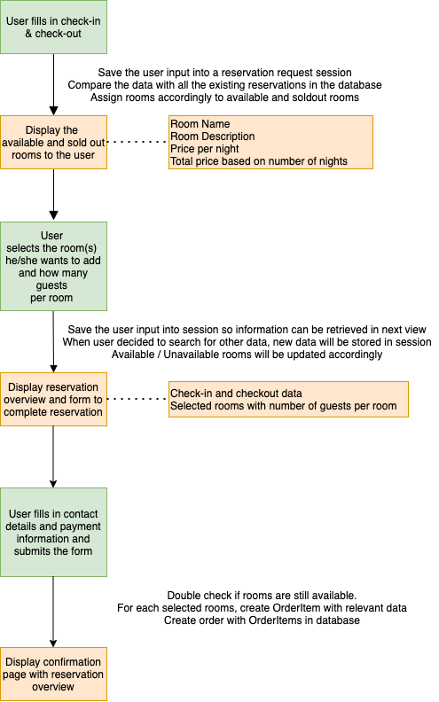
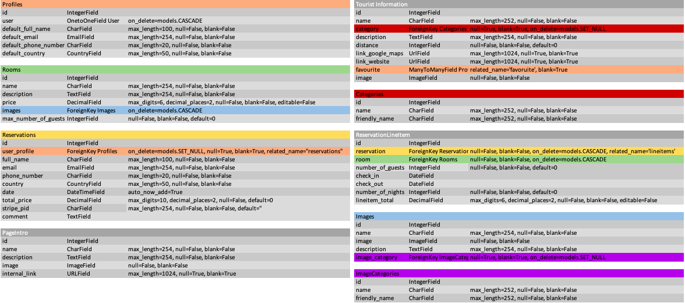
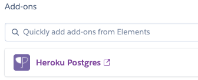

# **Casa Pedra Nobre**

``` Mock up Image ```

## **Goal for this project** 
Welcome to Casa Pedra Nobre, a bed & breakfast at the Silver Coast in Portugal.  
Have look at our website and discover what Casa Pedra Nobre has to offer.  
Book your favorite room, scroll down the MUST see, eat and do page and start planning your perfect stay in Portugal.   
We hope to welcome you on one of your Portugal trips in the near future.


This project was developed as my final project to complete the Full Stack Web Development course at Code Institute.   
I challenged myself for this last project by going out of the scope of the course because this project is close to my heart.   
This bed & breakfast belongs to my parents for which I did the start up in 2015.   
I managed the bed & breakfast for more than 2 years after which I passed it on to my parents to start my next adventure.  
You can find the original website here [Casa Pedra Nobre](www.casapedranobre.pt).

Thank you for visiting my project!  
If you have any feedback or questions, head over to my GitHub contact details and feel free to reach out to me.

---

<a></a>

## Table of contents 
* [UX](#ux)
    * [User Goals](#user-goals)
    * [User Stories](#user-stories)
    * [Site Owners Goals](#site-owners-goals)
    * [User Requirements and Expectations](#user-requirements-and-expectations)
        * [Requirements](#requirements)
        * [Expectations](#expectations)
    * [Design Choices](#design-choices)
        * [Fonts](#fonts)
        * [Colors](#colors)
        * [Structure](#structure)
* [Wireframes and Flowcharts](#wireframes-and-flowcharts)
    * [Wireframes](#wireframes)
    * [Flowcharts](#flowcharts)
    * [Database Structure](#database-structure)
* [Features](#features)
    * [Existing Features](#existing-features)
    * [Features to be implemented](#features-to-be-implemented)
* [Technologies used](#technologies-used)
    * [Languages](#languages)
    * [Libraries and Frameworks](#libraries-and-frameworks)
    * [Tools](#tools)
* [Testing](#testing)
* [Deployment](#deployment)
    * [Local Deployment](#local-deployment)
    * [Heroku Deployment](#heroku-deployment)
* [Credits](#credits)

--- 

<a name="ux"></a>

## **UX**

<a></a>

### **User Goals**

* The landing page should create a instant good feeling, motivating the user to look at the rest the of site.
* The website has to work well on all kind of devices like mobile phones, tables and desktops.
* Ability to see the various rooms that the accommodation offers.
* Have some information about the surroundings of the accommodation like restaurants, places to visit etc.
* Be able to make a reservation online
* Visually appealing website

[Back to Top](#table-of-contents)

<a></a>

### **User Stories**

As a user:  
* I want the website to be visually appealing so I can already imagine myself being on holiday there.
* I want to have some information about the property and it's location.
* I want to have an intuitive navigation so I know right away where I can find which information.
* I want to see which different rooms the accommodation has to offer.
* I want to know what kind of amenities are included in the room.
* I want to see a lot of pictures so I can really visualize the place.
* I want to be able to make a reservation on the website itself.
* I want to be able to choose the exact room in which I want to stay.
* I want to have some information about the surroundings of the accommodation.
* I want to be able to get in contact with the propery in case I have some questions.
* I want to know the address and how far / close it is to big cities.

### **Site owners Goals**

As an owner:  
* I want to promote my propery the best way possible to attract new customers.
* I want to increase direct bookings by making the booking process easy and intuitive.
* I want to be able to see all the reservations.
* I want to have a seperate section for arriving and inhouse reservations.
* I want to have a seperate section as well for the reservations for the next 7 days so I can plan in advance.
* I want to be able to update the rooms easily in case I make some improvements to the room.
* I want to be able to add some rooms in case I decide to expand the accommodation.
* I want to be able to easily add some news places to visit, eat so the information stays accurrate and up-to-date.

<a></a>


[Back to Top](#table-of-contents)

<a></a>

### **User Requirements and Expectations**

<a></a>

#### Requirements

* Easy to navigate by having a responsive navigation bar and various links to other pages througout the site.
* Appealing landing page creating a warm feeling towards the place.
* Easy to find the various rooms and its amenities.
* Possibility to make a reservation.
* Find information about the environment, things to do, eat, see etc.
* Contact information like email, phone and address.
* Many images to be able to visualize how my holiday would look like.

<a></a>

#### Expectations

* When clicking on links to external pages, I expect them to open in a different window.
* When making a reservation, I expect to receive an email with the confirmation of my reservation.
* I expect that the navigation links work properly so that is takes me wherever I want to go
* Website is in line with the customer's journey
* When making a reservation, I expect that the correct prices and availability are displayed so no surprises will show up later.


[Back to Top](#table-of-contents)

<a></a>

### **Design Choices**

I have spent quite some time thinking about the design of the website for CPN. 
I will use the real logo og CPN and I will integrate the colors of the logo into the website.
The colors used bring a southern feeling to website which fits perfect with the location, Portugal. 

I have used [Coolors](https://coolors.co/ "Coolors.co") to come up with the exact color scheme.  
You can find more information about the colors below. 

<a></a>

#### Colors

As CPN is THE place for guests to come and unwind, I wanted to user calming colors with a southern accent.


``` Color Palette ```

* #0C1E50
* #FCBC49
* #FFFFEB
* 853D1E

I have used a contrast checker in order to make sure that the contrast is sufficient.
This way my content will be easily readable. 

<a></a>


#### Fonts
In order to find appropriate fonts for my website, I have visited [Google Fonts](https://fonts.google.com/ "Google Fonts") to explore the various options.
For the titles and subtitles, I will use the font [Baskervville](https://fonts.google.com/specimen/Baskervville "Baskervville") 
and for the main text I have used [Karla](https://fonts.google.com/specimen/Karla "Karla"). 

<a></a>

#### Structure

All my pages will start with a hero image, related to the content of the page with the navigation on top of the image.
My website will have the following pages:

* Landing / Home Page  
    The landing page is aimed to be visually attractive, with appealing images/icons that says "Welcome" by itself,  
    unconsciously engaging the user and creating curiosity to keep navigating throughout the websute.

* Rooms  
    Here the rooms will be displayed with some images and a description of the rooms.  
    Below there will be some additional information which will be equal for all the rooms.

* Reservation page  
    This section will consists of multiple step spreaded over multiple pages.  
    Step 1: user selects preferred check-in and check-out data.  
    Step 2: available rooms and their prices will be displayed and the user select the amount of guests per room and add the room(s) they want.  
    Step 3: summary of the selected rooms and check-in/check-out data will be displayed, together with a form a finalise the reservation.  
    Step 4: Confirmation page will be displayed to the user.  

* Tourist Information  
    The page will consist out of 3 different sections:
    * Things to see: here I will display the villages and beaches in the surroundings of the bed & breakfast in card format,  
        the cards will be displayed in a carousel through which the user can navigate. 
    * Places to eat: the format / display will be the same but the cards will contain restaurants and bars.
    * Things to do: again the format / display will maintain the same but the content will change to activities and experiences.

* Gallery  
    The gallery page will be divided in 2 sections: propery images and images of the surroundings.  
    The images will be places in a carousel with below a preview of the other pictures to create curiosity for the user.

* Account page  
    Here the user will find an overview of their account details and their upcoming / past bookings.  
    Below that I will display a Favorites section that will be fed by the user adding places, restaurants to their favorites.
    The display of these favorites will be the same as on the tourist information page.

[Back to Top](#table-of-contents)

--- 
<a></a>

## **Wireframes, Flowcharts and Database Structure**

### **Wireframes**
I used [Balsamic](https://balsamiq.com/wireframes/) to create wireframes for my website.   
For each page I created 3 wireframes: desktop, tablet and mobile.

[Landing / Home page](wireframes/home.png)  
[Reservation](wireframes/reservation.png)  
[Rooms](wireframes/rooms.png)  
[Tourist Information](wireframes/tourist_information.png)  
[Gallery](wireframes/gallery.png)  
[Profile](wireframes/profile.png)

### **Flowcharts**

I have decided to make a flowchart for the reservation process to completely understand each step.    
I have used [Draw.io](https://draw.io/) to make this flowchart which you can view below: 



### **Database Structure**

For the project I set up 9 database Models which you can see in the image below. 
I have highlighted the relationships between the various models with colors.



[Back to Top](#table-of-contents)

---

<a></a>

## **Features**

<a></a>

### **Existing Features**

* Registration and sign in functionality using the allauth package from Django
* Carousel on the homepage giving the user a peek into what the other pages have to offer
* Subscription section on each page allowing the user to subscribe to the newsletter, promotions etc.
* Reservation page that allows the user to book a stay for a certain period
* Add to favorites functionality which allows the user to add restaurants, places to visit etc to start planning their trip.

<a></a>

### **Features to be implemented**
* Dashboard for bed & breakfast owner with additional information:
    * More information about upcoming reservations, inhouse, checkout etc.
    * Reservations divided by room booked and displayed nicely in a calendar
* Add walks in the surroundings of the bed & breakfast on the tourist information page which the user can download

[Back to Top](#table-of-contents)

<a></a>

## **Technologies used**

<a></a>

### **Languages**

* [HTML](https://en.wikipedia.org/wiki/HTML)
* [CSS](https://en.wikipedia.org/wiki/Cascading_Style_Sheets)
* [JavaScript](https://en.wikipedia.org/wiki/JavaScript)
* [Python](https://www.python.org/)

<a></a>

### **Libraries and Frameworks**

* [Font Awesome](https://fontawesome.com/)
* [Bootstrap](https://getbootstrap.com/)
* [Google Fonts](https://fonts.google.com/)
* [jQuery](https://jquery.com/)
* [Stripe](http://stripe.com/)

### **Tools**
* [Django](https://www.djangoproject.com/)
* [Git](https://git-scm.com/)
* [GitPod](https://www.gitpod.io/)
* [Heroku](https://www.heroku.com/)
* [Balsamic](https://balsamiq.com/wireframes/)
* [W3C HTML Validation Service](https://validator.w3.org/)
* [W3C CSS Validation Service](https://jigsaw.w3.org/css-validator/)
* [techsini](http://techsini.com/)


[Back to Top](#table-of-contents)

<a></a>

## Testing

## Bugs

### Footer was coming out of screen
#### Resolved by removing padding on footer-container

### Toggler Icon Navbar not showing
#### Resolved by adding navbar-dark to navbar and overwriting this

### Date Icon reservation request black
#### ::-webkit-calendar-picker-indicator { filter: invert(1);}

## **Deployment**

### Local Deployment

I have created the project using Github, from there I used [Gitpod](https://gitpod.io/) to write my code. 
Then I used commits to git followed by "git push" to my GitHub repository. 
I've deployed this project to Heroku and used "git push heroku master" to make sure my pushes to GitHub were also made to Heroku. 

This project can be ran locally by following the following steps: 
I used Gitpod for development, so the following steps will be specific to Gitpod. 
You will need to adjust them depending on your IDE. You can find more information about installing packages using pip and virtual environments [here](https://packaging.python.org/guides/installing-using-pip-and-virtual-environments/)

To clone the project: 

1. From the application's repository, click the "code" button and download the zip of the repository.
    Alternatively, you can clone the repository using the following line in your terminal:

    ``` 
    git clone "LINK"
    ``` 

1. Access the folder in your terminal window and install the application's [link to required modules]() using the following command:

    ```
    pip3 install -r requirements.txt
    ```

1. In your IDE, create a file containing your environmental variables called env.py at the root level of the application. 
    It will need to contain the following lines and variables:
    ```
    import os

    os.environ[""] = ""
    
    ```

    If you plan on pushing this application to a public repository, ensure that env.py is added to your .gitignore file.

1. Migrate the database models with the following command
    ```
    python3 manage.py migrate
    ```
1. Create a superuser and set up the credentials with the following command
    ```
    python3 manage.py createsuperuser
    ```
1. Run the app with the following command
    ```
    python manage.py runserver
    ```
    The address to access the website is displayed in the terminal  
    Add /admin to the end to access the admin panel with your superuser credentials

    
### To deploy your project on Heroku, use the following steps: 

1. Login to your Heroku account and create a new app. Choose your region. 
1. Once the app is created click on the resources button and choose the Heroku Postgres to attach a postgres database to your project.
    

<!-- 1. Scroll down to "deployment method"-section. Choose "Github" for automatic deployment. -->
<!-- 1. From the inputs below, make sure your github user is selected, and then enter the name for your repo. Click "search". When it finds the repo, click the "connect" button. -->
1. Scroll back up and click "settings". Scroll down and click "Reveal config vars". Set up the same variables as in your env.py ():
    !You shouldn't set the DEBUG variable in under config vars, only in your env.py to prevent DEBUG being active on live website. 

    ```
    DATABASE_URL 
    ```
1. From this screen, copy the value of DATABASE_URL
1. After this go to your settings.py and comment out the default database configuration and add:
    ```
    DATABASES = {
        'default': dj_database_url.parse(os.environ.get('< Put your DATABASE_URL here >'))
    }
    ```
1. Migrate again with the following command
    ```
    python3 manage.py migrate
    ```

1. After migrations are complete, change database configurations to:
```
    if 'DATABASE_URL' in os.environ:
        DATABASES = {
            'default': dj_database_url.parse(os.environ.get('DATABASE_URL'))
        }
    else:
        DATABASES = {
            'default': {
                'ENGINE': 'django.db.backends.sqlite3',
                'NAME': os.path.join(BASE_DIR, 'db.sqlite3'),
            }
        }
```
This set up will allow your site to use Postgres in deployment and sqlite3 in development.

1. Create a superuser for the postgres database so you can have access to the django admin by setting up the credentials with the following command
    ```
    python3 manage.py createsuperuser
    ```

1. Create a Procfile freeze your requirements by running the following commands: 
    Requirements:
    ```
    pip3 freeze --local > requirements.txt
    ```
    Procfile:
    ```
    echo web: python app.py > Procfile
    ```
1. The Procfile should contain the following line:
    ```
    web: gunicorn <project_name>.wsgi:application

    ```

1. Add your files and commit them to GITHUB by running the following commands:
    ```
    git add . 
    git commit -m "Your commit message"
    git push
    ```

1. Set up AWS

1. Go back to HEROKY and click "Deploy". Scroll down and click "Enable automatic deployment".
1. Just beneath, click "Deploy branch". Heroku will now start building the app. When the build is complete, click "view app" to open it.
1. In order to commit your changes to the branch, use git push to push your changes. 
    


[Back to Top](#table-of-contents)

<a></a>

## **Credits**

* https://epicbootstrap.com/snippets/lightbox-gallery 