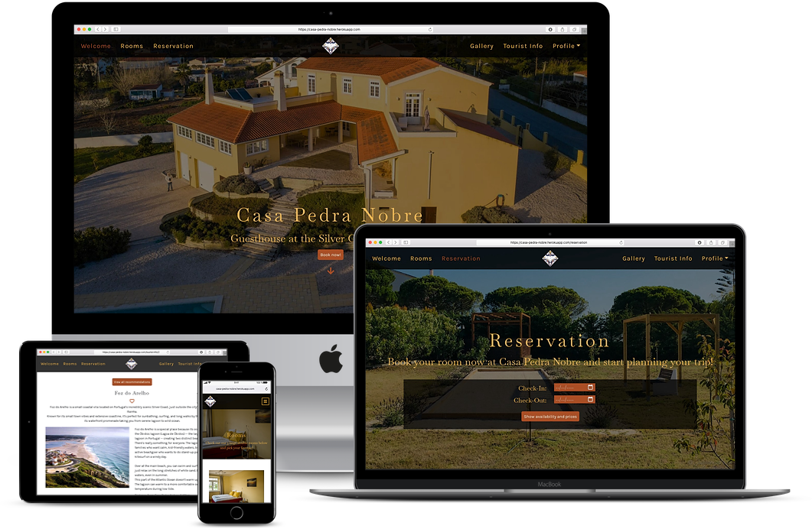
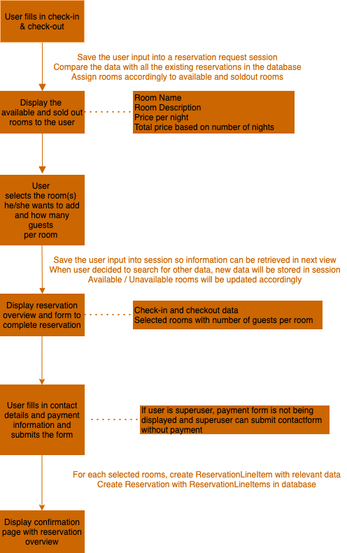
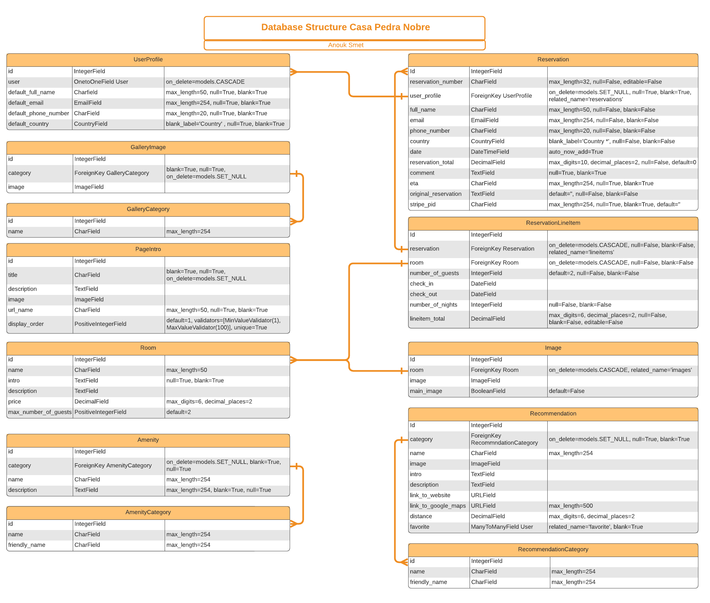

# **Casa Pedra Nobre**



## **Goal for this project** 
Welcome to Casa Pedra Nobre, a bed & breakfast at the Silver Coast in Portugal.  
Have look at our website and discover what Casa Pedra Nobre and the Silver Coast has to offer.  
Book your favorite room, scroll down the MUST see, eat and do page and start planning your perfect stay in Portugal.   
We hope to welcome you on one of your Portugal trips in the near future.

This project was developed as my final project to complete the Full Stack Web Development course at Code Institute.   
I challenged myself for this last project by going out of the scope of the course because this project is close to my heart.   
This bed & breakfast belongs to my parents for which I did the start up in 2015.   
I managed the bed & breakfast for more than 2 years after which I passed it on to my parents to start my next adventure.  
You can find the original website here [Casa Pedra Nobre](https://casapedranobre.pt/).

Thank you for visiting my project!  
If you have any feedback or questions, head over to my GitHub contact details and feel free to reach out to me.

---

<a></a>

## Table of contents 
* [UX](#ux)
    * [User Goals](#user-goals)
    * [User Stories](#user-stories)
    * [Site Owners Goals](#site-owners-goals)
    * [User Requirements and Expectations](#user-requirements-and-expectations)
        * [Requirements](#requirements)
        * [Expectations](#expectations)
    * [Design Choices](#design-choices)
        * [Fonts](#fonts)
        * [Colors](#colors)
        * [Structure](#structure)
* [Wireframes and Flowcharts](#wireframes-and-flowcharts)
    * [Wireframes](#wireframes)
    * [Flowcharts](#flowcharts)
    * [Database Structure](#database-structure)
* [Features](#features)
    * [Existing Features](#existing-features)
    * [Features to be implemented](#features-to-be-implemented)
* [Technologies used](#technologies-used)
    * [Languages](#languages)
    * [Libraries and Frameworks](#libraries-and-frameworks)
    * [Tools](#tools)
* [Testing](#testing)
* [Deployment](#deployment)
    * [Local Deployment](#local-deployment)
    * [Heroku Deployment](#heroku-deployment)
* [Credits](#credits)

--- 

<a name="ux"></a>

## **UX**

<a></a>

### **User Goals**

* The landing page should create a instant good feeling, motivating the user to look at the rest the of site.
* The website has to work well on all kind of devices like mobile phones, tables and desktops.
* Ability to see the various rooms that the accommodation offers.
* Have some information about the surroundings of the accommodation like restaurants, places to visit etc.
* Be able to make a reservation online
* Visually appealing website

[Back to Top](#table-of-contents)

<a></a>

### **User Stories**

As a user:  
* I want the website to be visually appealing so I can already imagine myself being on holiday there.
* I want to have some information about the property and it's location.
* I want to have an intuitive navigation so I know right away where I can find which information.
* I want to see which different rooms the accommodation has to offer.
* I want to know what kind of amenities are included in the room.
* I want to see a lot of pictures so I can really visualize the place.
* I want to be able to make a reservation on the website itself.
* I want to be able to choose the exact room in which I want to stay.
* I want to have some information about the surroundings of the accommodation.
* I want to be able to get in contact with the propery in case I have some questions.
* I want to know the address and how far / close it is to big cities.

### **Site owners Goals**

As an owner:  
* I want to promote my propery the best way possible to attract new customers.
* I want to increase direct bookings by making the booking process easy and intuitive.
* I want to be able to see all the reservations.
* I want to have a seperate section for arriving and inhouse reservations.
* I want to have a seperate section as well for the reservations for the next 7 days so I can plan in advance.
* I want to be able to update the rooms easily in case I make some improvements to the room.
* I want to be able to add some rooms in case I decide to expand the accommodation.
* I want to be able to easily add some news places to visit, eat so the information stays accurrate and up-to-date.

<a></a>


[Back to Top](#table-of-contents)

<a></a>

### **User Requirements and Expectations**

<a></a>

#### Requirements

* Easy to navigate by having a responsive navigation bar and various links to other pages througout the site.
* Appealing landing page creating a warm feeling towards the place.
* Easy to find the various rooms and its amenities.
* Possibility to make a reservation.
* Find information about the environment, things to do, eat, see etc.
* Contact information like email, phone and address.
* Many images to be able to visualize how my holiday would look like.

<a></a>

#### Expectations

* When clicking on links to external pages, I expect them to open in a different window.
* When making a reservation, I expect to receive an email with the confirmation of my reservation.
* I expect that the navigation links work properly so that is takes me wherever I want to go
* Website is in line with the customer's journey
* When making a reservation, I expect that the correct prices and availability are displayed so no surprises will show up later.


[Back to Top](#table-of-contents)

<a></a>

### **Design Choices**

I have spent quite some time thinking about the design of the website for CPN. 
I will use the real logo og CPN and I will integrate the colors of the logo into the website.
The colors used bring a southern feeling to website which fits perfect with the location, Portugal. 

I have used [Coolors](https://coolors.co/ "Coolors.co") to come up with the exact color scheme.  
You can find more information about the colors below. 

<a></a>

#### Colors

As CPN is THE place for guests to come and unwind, I wanted to user calming colors with a southern accent.


``` Color Palette ```

* #0C1E50
* #FCBC49
* #FFFFEB
* 853D1E

I have used a contrast checker in order to make sure that the contrast is sufficient.
This way my content will be easily readable. 

<a></a>


#### Fonts
In order to find appropriate fonts for my website, I have visited [Google Fonts](https://fonts.google.com/ "Google Fonts") to explore the various options.
For the titles and subtitles, I will use the font [Baskervville](https://fonts.google.com/specimen/Baskervville "Baskervville") 
and for the main text I have used [Karla](https://fonts.google.com/specimen/Karla "Karla"). 

<a></a>

#### Structure

All my pages will start with a hero image, related to the content of the page with the navigation on top of the image.
My website will have the following pages:

* Landing / Home Page  
    The landing page is aimed to be visually attractive, with appealing images/icons that says "Welcome" by itself,  
    unconsciously engaging the user and creating curiosity to keep navigating throughout the website.
    On this page I want to display a sneak peek about every page, engaging the user to explore all Casa Pedra Nobre has to offer. 

* Rooms  
    Here the rooms will be displayed with some images and a short description of the rooms.
    Each room will also have a detail page, providing additional information to the user about the room. 
    Here the user will see all the image at a glance instead of in a carousel. There will also be a call to action to go to the reservations page.
    On the overview page of the rooms, below the rooms, there will be more information about the property. 
    This will include images from the breakfast, amenities, activities & experiences and policies. 

* Reservation page  
    This section will consists of multiple step spreaded over multiple pages.  
    Step 1: user selects preferred check-in and check-out data.  
    Step 2: available rooms and their prices will be displayed and the user select the amount of guests per room and add the room(s) they want.  
    Step 3: summary of the selected rooms and check-in/check-out data will be displayed, together with a form a finalise the reservation.  
    Step 4: Confirmation page will be displayed to the user.  

* Tourist Information  
    The page will consist out of 3 different sections:
    * Things to see: here I will display the villages and beaches in the surroundings of the bed & breakfast in card format,  
        the cards will be displayed in a carousel through which the user can navigate. 
    * Places to eat: the format / display will be the same but the cards will contain restaurants and bars.
    * Things to do: again the format / display will maintain the same but the content will change to activities and experiences.

* Gallery  
    The gallery page will be divided in 2 sections: property images and images of the surroundings.  
    Images will be displayed in a rather small format but with the possibility to click on the image to see it larger.
    There will be a counter and next/previous buttons to navigate through the gallery.

* Account page  
    Here the user will find an overview of their account details and their upcoming / past bookings.  
    Below that I will display a Favorites section that will be fed by the user adding places, restaurants to their favorites.
    The display of these favorites will be the same as on the tourist information page.

* Reservations page for admin
    For the owner of the breakfast or admin (superuser), there is a separate page with an overview of all the reservations. 
    The page is divided into 6 different sections: arrivals today / departures today / inhouse guests / arrivals next 7 days / all upcoming reservations / all past reservations
    With the help of the [Datatable CDN](https://cdn.datatables.net/), the reservations will be displayed in a nice table with the following functionailities:
    * Search functionality to search by name, date, room etc.
    * Pagination
    * Ability to show 10 / 25 / 50 / 100 reservations per page
    * Ability to sort on each of the columns
    * Link to the reservation confirmation page

[Back to Top](#table-of-contents)

--- 
<a></a>

## **Wireframes, Flowcharts and Database Structure**

### **Wireframes**
I used [Balsamic](https://balsamiq.com/wireframes/) to create wireframes for my website.   
For each page I created 3 wireframes: desktop, tablet and mobile.

[Landing / Home page](wireframes/home.png)  
[Reservation](wireframes/reservation.png)  
[Rooms](wireframes/rooms.png)  
[Tourist Information](wireframes/tourist_information.png)  
[Gallery](wireframes/gallery.png)  
[Profile](wireframes/profile.png)

While I was working on the project, I have made some decision that vary from the original wireframes.
This because I thought that my new ideas contributed better for a good user experience. 
Below you can find the major differences + reasoning behind it: 

#### Reservation Step 1 
Here I have decided to implement the form inside the hero image instead of below. 
Before the hero image took up 100vh of the screen and the user had to scroll down to insert the data. 
While when you are on the reservations page, that is the main thing you want to do. So it should be easily within reach. 

As I received some great feedback about the image from users who were testing the website, I decided to combine the 2 instead. 
This change has improved the user experience as they don't have to look for where to insert check-in and check-out data while still keeping the page visually appealing.

#### Display of images in Gallery
For the Gallery I have decided to show a small preview of all the images instead of one image larger, with a couple of small previews below. 
The user can still click on the image to see it bigger but the user can see all the images at first sight without having to scroll trough the carousel.

The images are one of the most important aspects for users to choose their next holiday, I didn't want the user to miss out on viewing all the images. 

#### Tourist Info
Instead of displaying the recommendation in a carousel for each category, I have decided to show 3 main buttons on the page. 
The user can easily shows which category he or she wants to see first. When clicking on the button, the recommendation will appear nicely below in card form. 

It was after doing some research that I decided to go with this approach. It is not considered good practice to include a carousel that has many slides. 
As I didn't want to exclude recommendations, I decided to go for this approach. 
This way the user also doesn't have to scroll down in order to see the different categories available but sees them at first sight.


### **Flowcharts**

I have decided to make a flowchart for the reservation process to completely understand each step.    
I have used [Draw.io](https://draw.io/) to make this flowchart which you can view below: 



### **Database Structure**

For the project I set up 9 database Models which you can see in the image below. 
I have highlighted the relationships between the various models with colors.



[Back to Top](#table-of-contents)

---

<a></a>

## **Features**

<a></a>

### **Existing Features**

* Registration and sign in functionality using the allauth package from Django
* Carousel on the homepage giving the user a sneak peek into what the other pages have to offer
* Social Media section on various page allowing the user to interact and stay up to date about the latest news and promotions.
* Reservation page that allows the user to book a stay for a certain period
* Add to favorites functionality which allows the user to add restaurants, places to visit etc to start planning their trip.
* Possibility for superuser / admin to make a reservation online without having to go through the payment. This so that owner can make reservations for users when they call for example.  
    In order for the owner to know whether the reservation was already paid or not (if owner makes it, no payment is done yet), I have added a column on the reservations page which checks for the stripe pid. 
    If there is no PID, the reservations shows as not paid yet. 

<a></a>

### **Features to be implemented**
* Dashboard for bed & breakfast owner with additional information:
    * Reservations divided by room booked and displayed nicely in a calendar
* Add walks in the surroundings of the bed & breakfast on the tourist information page which the user can download
* Implement additional functionality that calculates the price depending on the amount of guests, length of stay, season and so on.
* Implement promotions for multiple nights which would be advertisement on a separate page with a link to book that specific promotion
* Improve performance by using responsive images and minifying my css files
* Give the admin the possibility to edit reservations instead of only deleting and creating a new one

[Back to Top](#table-of-contents)

<a></a>

## **Technologies used**

<a></a>

### **Languages**

* [HTML](https://en.wikipedia.org/wiki/HTML)
* [CSS](https://en.wikipedia.org/wiki/Cascading_Style_Sheets)
* [JavaScript](https://en.wikipedia.org/wiki/JavaScript)
* [Python](https://www.python.org/)

<a></a>

### **Libraries and Frameworks**

* [Font Awesome](https://fontawesome.com/)
* [Bootstrap](https://getbootstrap.com/)
* [Google Fonts](https://fonts.google.com/)
* [jQuery](https://jquery.com/)
* [Stripe](http://stripe.com/)

### **Tools**
* [Django](https://www.djangoproject.com/)
* [Git](https://git-scm.com/)
* [GitPod](https://www.gitpod.io/)
* [Heroku](https://www.heroku.com/)
* [Balsamic](https://balsamiq.com/wireframes/)
* [W3C HTML Validation Service](https://validator.w3.org/)
* [W3C CSS Validation Service](https://jigsaw.w3.org/css-validator/)
* [techsini](http://techsini.com/)


[Back to Top](#table-of-contents)

<a></a>

## Testing
Testing of this site can be found [here](https://github.com/AnoukSmet/casa-pedra-nobre/blob/master/testing.md) in a seperate file

## Bugs
Bugs of this site can be found [here](https://github.com/AnoukSmet/casa-pedra-nobre/blob/master/bugs.md) in a seperate file


## **Deployment**

### Local Deployment

I have created the project using Github, from there I used [Gitpod](https://gitpod.io/) to write my code. 
Then I used commits to git followed by "git push" to my GitHub repository. 
I've deployed this project to Heroku and used "git push heroku master" to make sure my pushes to GitHub were also made to Heroku. 

For this project you need to create an account on Stripe for the reservation module as well as an account on AWS in order to store your static and media files.

This project can be ran locally by following the following steps: 
I used Gitpod for development, so the following steps will be specific to Gitpod. 
You will need to adjust them depending on your IDE. You can find more information about installing packages using pip and virtual environments [here](https://packaging.python.org/guides/installing-using-pip-and-virtual-environments/)

To clone the project: 

1. From the application's repository, click the "code" button and download the zip of the repository.
    Alternatively, you can clone the repository using the following line in your terminal:

    ``` 
    git clone https://github.com/AnoukSmet/Casa-Pedra-Nobre.git
    ``` 

1. Access the folder in your terminal window and install the application's [link to required modules](https://github.com/AnoukSmet/Casa-Pedra-Nobre/blob/master/requirements.txt) using the following command:

    ```
    pip3 install -r requirements.txt
    ```

1. In your IDE, create a file containing your environmental variables called env.py at the root level of the application. 
    It will need to contain the following lines and variables:
    ```
    import os

    os.environ["SECRET_KEY"] = "YOUR_SECRET_KEY"
    os.environ["DEVELOPMENT"] = "True"

    os.environ["STRIPE_PUBLIC_KEY"] = "STRIPE_PUBLIC_KEY"
    os.environ["STRIPE_SECRET_KEY"] = "STRIPE_SECRET_KEY"
    os.environ["STRIPE_WH_SECRET"] = "STRIPE_WH_SECRET"
        
    ```
    
    If you're not sure how to get the above Stripe variables, please visit the [Stripe Documentation](https://stripe.com/docs)

    If you plan on pushing this application to a public repository, ensure that env.py is added to your .gitignore file.

1. Migrate the database models with the following command
    ```
    python3 manage.py migrate
    ```
1. Create a superuser and set up the credentials with the following command
    ```
    python3 manage.py createsuperuser
    ```
1. Run the app with the following command
    ```
    python manage.py runserver
    ```
    The address to access the website is displayed in the terminal  
    Add /admin to the end to access the admin panel with your superuser credentials

    
### To deploy your project on Heroku, use the following steps: 

1. Login to your Heroku account and create a new app. Choose your region. 
1. Once the app is created click on the resources button and under Add-ons, look for the Heroku Postgres to attach a postgres database to your project.
    Select the Hobby Dev - Free plan and click 'Submit order form'

    

1. Scroll back up and click "settings". Scroll down and click "Reveal config vars". Set up the same variables as in your env.py ():
    !You shouldn't set the DEBUG variable in under config vars, only in your env.py to prevent DEBUG being active on live website. 

    ```
    AWS_ACCESS_KEY_ID = "AWS_ACCESS_KEY_ID"
    AWS_SECRET_ACCESS_KEY = "AWS_SECRET_ACCESS_KEY"
    DATABASE_URL = "This variable is automatically set when adding the Postgres Add on"
    SECRET_KEY = "SECRET_KEY"
    STRIPE_PUBLIC_KEY = "STRIPE_PUBLIC_KEY"
    STRIPE_SECRET_KEY = "STRIPE_SECRET_KEY"
    STRIPE_WH_SECRET = "STRIPE_WH_SECRET"
    USE_AWS = True
    ```
1. From this screen, copy the value of DATABASE_URL
1. After this go to your settings.py the casa_pedra_nobre directory and comment out the default database configuration and add:
    ```
    DATABASES = {
        'default': dj_database_url.parse('Put your DATABASE_URL here'))
    }
    ```
1. Migrate again with the following command
    ```
    python3 manage.py migrate
    ```


1. Create a superuser for the postgres database so you can have access to the django admin by setting up the credentials with the following command
    ```
    python3 manage.py createsuperuser
    ```

    --> Don't forget to login to the admin page and check the boxes 'Verified and primary"

1. Load the data into your newly created database by using the following command: 

    ```
    python3 manage.py loaddata <name of file containing the data>
    ``` 

1. After migrations are complete, change database configurations to:
```
    if 'DATABASE_URL' in os.environ:
        DATABASES = {
            'default': dj_database_url.parse(os.environ.get('DATABASE_URL'))
        }
    else:
        DATABASES = {
            'default': {
                'ENGINE': 'django.db.backends.sqlite3',
                'NAME': os.path.join(BASE_DIR, 'db.sqlite3'),
            }
        }
```
This set up will allow your site to use Postgres in deployment and sqlite3 in development.


1. Make sure you have your requirements.txt file and your Procfile. In case you don't, follow the below steps:
    Requirements:
    ```
    pip3 freeze --local > requirements.txt
    ```
    Procfile:
    ```
    echo web: python app.py > Procfile
    ```
1. The Procfile should contain the following line:
    ```
    web: gunicorn <project_name>.wsgi:application

    ```

1. Add your files and commit them to GITHUB by running the following commands:
    ```
    git add . 
    git commit -m "Your commit message"
    git push
    ```

1. Add your Heroku app URL to ALLOWED_HOSTS in your settings.py file
1. Disable collect static so that Heroku doesn't try to collect static files when you deploy by typing the following command in the terminal
    ```
    heroku config:set DISABLE_COLLECTSTATIC=1
    ```
1. Go back to HEROKU and click "Deploy" in the navigation. 
1. Scroll down to Deployment method and Select Github. 
1. Look for your repository and click connect. 
1. Under automatic deploys, click 'Enable automatic deploys'

1. Just beneath, click "Deploy branch". Heroku will now start building the app. When the build is complete, click "view app" to open it.
1. In order to commit your changes to the branch, use git push to push your changes. 


1. Store your static files and media files on AWS. You can find more information about this on [Amazon S3 Documentation](https://docs.aws.amazon.com/AmazonS3/latest/userguide/Welcome.html).
    If you would like to follow a tutorial instead, visit [this tutorial on Youtube from Amazon Web Services](https://youtube.com/watch?v=e6w9LwZJFIA)

1. Set up email service to send confirmation email and user verification email to the users. You can do this by following the next steps (Gmail only)

(Be aware that this migth be different for other providers or the process might have changed over time)

* Go to your email account and go to your account settings
* Under Security, scroll down to Signing in to Google and make sure 2 step verification is turned on
* Under the same heading (Signing in to Google) you will see the 'App passwords' option.
* Click on the option, select mail for the app and under device type select other and fill in 'Django'
* You will now get a password which you should copy and set it as a config variable in Heroku:

```
    EMAIL_HOST_PASS = 'Password you just copied'
    EMAIL_HOST_USER = 'Your gmail account
```
* Go to your settings.py in casa_pedra_nobre directory and add the following:

```
    if "DEVELOPMENT" in os.environ:
        EMAIL_BACKEND = 'django.core.mail.backends.console.EmailBackend'
        DEFAULT_FROM_EMAIL = 'your gmail account'
    else:
        EMAIL_BACKEND = 'django.core.mail.backends.smtp.EmailBackend'
        EMAIL_USE_TLS = True
        EMAIL_PORT = 587
        EMAIL_HOST = 'smtp.gmail.com'
        EMAIL_HOST_USER = os.environ.get('EMAIL_HOST_USER')
        EMAIL_HOST_PASSWORD = os.environ.get('EMAIL_HOST_PASS')
        DEFAULT_FROM_EMAIL = os.environ.get('EMAIL_HOST_USER')
```


[Back to Top](#table-of-contents)

<a></a>

## **Credits**

* Thank you to the creator(s) of the [Lightbox Gallery](https://epicbootstrap.com/snippets/lightbox-gallery), it has really helped me with the display of my image gallery  

* Thank you as well to the creator(s) of the [Datatables CDN](https://cdn.datatables.net/). This helped to provide a nice overview of all the reservations.

* Big thanks to the Stackoverflow Community who has helped me through a lot of problems. It is incredible to see how everyone is to eager to help each other. 

* A special thanks to my mentor Simen Eventyret_mentor, who once again, supported me throughout this challenging project.
    He has believed in me and this project when I didn't and has guided me through it. Thanks for the amazing help over the last couple of months!

This project was ofcourse very close to my heart, having run this bed & breakfast myself for more than 2 years. 
It was an honor for me to work on this project and I would like to thank my parents for delivering a lot of the content and images.
I also want to thank them and my husband-to-be Artur for the amazing (and critical, as it is also very close to their heart) testing they did. 
This has been a great help in order to improve the user experience even more. 


